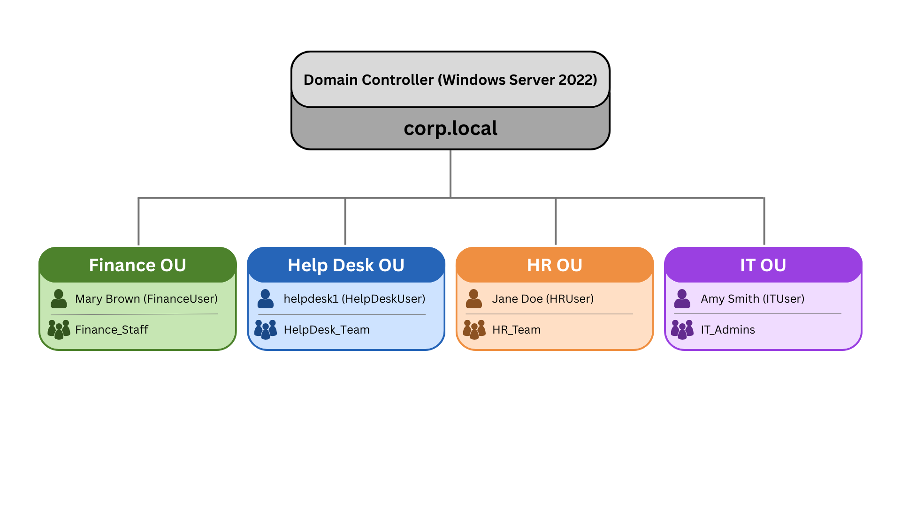

# Active Directory Lab

## Overview
This lab demonstrates the deployment and administration of an Active Directory domain in a virtualized environment. The lab was completed using Windows Server 2022 and Oracle VirtualBox.

## Objectives
- Deploy a Windows Server 2022 domain controller
- Create and manage user and computer accounts
- Organize resources into OUs (Organizational Units)
- Implement Group Policy Objects (GPOs) for desktop and login configurations
- Join Windows client machines to the domain and troubleshoot login issues

## Tools Used
- Windows Server 2022 Standard (Desktop Experience)
- Oracle VirtualBox
- Active Directory Domain Services (AD DS)
- Group Policy Management Console
- PowerShell (optional scripts for automation)

## Skills Demonstrated
- Domain setup and administration
- User and group management
- GPO creation and management
- Client-domain integration
- Troubleshooting authentication and policy application issues
- Security best practices (least-privilege accounts, access control)
  
## Screenshots

**Structure Diagram**

**OU Structure**

**Finance OU Objects**

**Finance Group Members**

**GPO Help Desk Wallpaper**

**Saved Query - All Users**

**PowerShell - List all Users**

